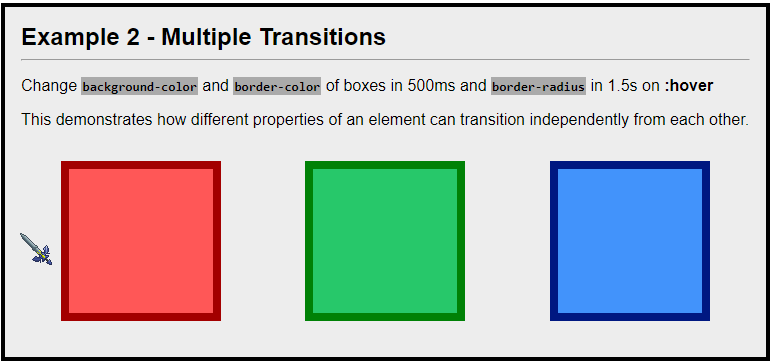

# Day 71: March 17, 2019

**Today's Progress:** Continued with CSS Transitions and how to setup different transitions within the same element.

**Thoughts:** Sometimes I get caught up with styling the forms better but I can't help myself! ^^; Glad to be diving into some of the features CSS3 Transitions brings to the table. Excited to start on more animations tomorrow.

**Link(s) to work:**
* CSS Transitions - [Project Directory](../work/css/transitions)

**Learning Resources:**
* [Transitions](https://learn.shayhowe.com/advanced-html-css/transitions-animations/)