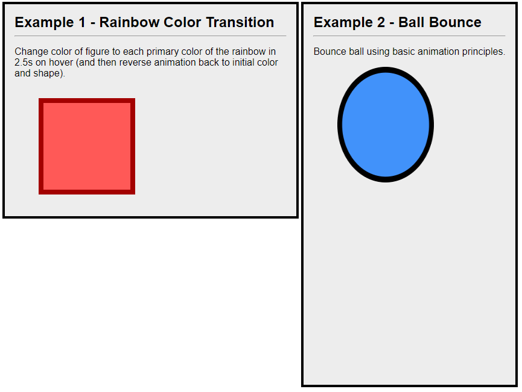

# Day 73: March 23, 2019

**Today's Progress:** Learned about how to use CSS Animations.

**Thoughts:** Fiddled with animating using the `animation` property and `@keyframe`.



 When investigating what the core differences were between this and using the `transition` property, I found this quote from Dimitar Ivanov's blog:

_"The most important difference between CSS transition and CSS animation is how they are triggered. A transition occurs when the element state or property is changed. For example color change on hover; change of width on click using javascript. While transitions are easier to use, the animations offer more control over how the states are animated."_ - Dimitar Ivanov 2015

Both methods of animating markup are valid and solve different problems, so it's important to understand one way isn't the best solution to use for all situations. If an element is `:active` for example, it may be easier to use `transition`:

```css
    /* Transition */
    button {
        transition-property: transform 200ms linear;
    }

    button:active {
        transform: scale(.85);
    }
```
as opposed to `animation`:
```css
    /* Animation */
    button {
        animation: shrink 200ms linear;
    }

    @keyframe shrink {
        0% {
            transform: scale(1);
        }
        50% {
            transform: scale(.85);
        }
        100% {
            transform: scale(1);
        }
    }

```

`animation` however is easier to work with when you start adding on a pile of properties that need to be modified throughout the cycle.

**Link(s) to work:**
* CSS Animations - [Project Directory](../work/css/animations)

**Learning Resources:**
* [Transitions/Animations](https://learn.shayhowe.com/advanced-html-css/transitions-animations/)
* [The Guide to CSS Animation Principles and Examples](https://www.smashingmagazine.com/2011/09/the-guide-to-css-animation-principles-and-examples/)
* CSS-Transitions - [Dimitar Ivanov Blog](https://zinoui.com/blog/css-transitions)