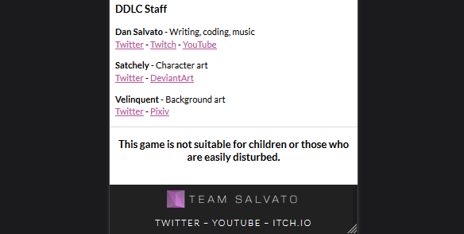

# Day 85: May 4, 2019

**Today's Progress:** More work towards responsive design of [ddlc.moe](https://ddlc.moe) clone.

**Thoughts:** Added more responsive tweaks like making the disclosure message at the bottom naturally responsive (removed ` ` from middle of text) and adjusted layout of the footer elements using a `@media` query.

Next session will start to use more `@media` queries to create layouts for tablets and desktops!

**Learning Resources:**
* What is the smallest screen size you design for? - [StackOverflow](https://ux.stackexchange.com/questions/53911/what-is-the-smallest-screen-size-you-design-for)
* [Viewport Sizes](http://viewportsizes.com)

**Link(s) to work:**
* DDLC Clone - [GitHub](https://github.com/mccoyrjm/ddlc-clone)
