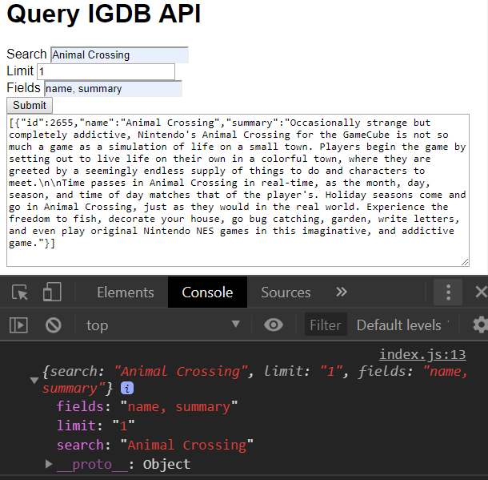

# Day 88: May 20, 2019

**Today's Progress:** Created `QueryBuilder` helper to handle constructing queries to IGDB API. Set up basic form to test proxy server calls.

**Thoughts:** Now have a Front-End and a Back-End! While tonight's main focus was making the `QueryBuidler` module, fit in verifying calls to the proxy server were working too.

**Link(s) to work:**
* Game Collection Tracker - [GitHub](https://github.com/mccoyrjm/game-collection-tracker)
