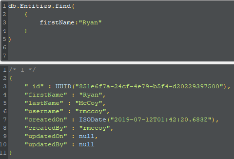

# Day 91: July 11, 2019

**Today's Progress:** MongoDB Basics via Robo 3T

**Thoughts:** To get the game tracking going, I need to connect my user data with the games retrieved from IGDB API. This required getting my MongoDB database set up. They devs were on top of it because they had the perfect section in their documentation: [SQL to MongoDB Mapping Chart](https://docs.mongodb.com/manual/reference/sql-comparison/)

Helped a ton!

