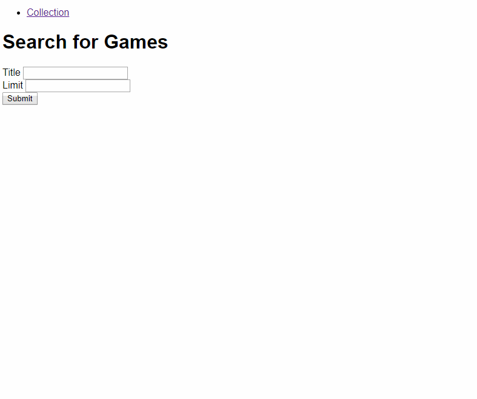

# Day 92: July 13, 2019

**Today's Progress:** Setup first implementation of the database and added API calls to GET/POST a user's game collection!

**Thoughts:** Getting more comfortable working with MongoDB. Getting the core functionality implemented feels good! These features will be important to be polished for a MVP. Other ideas are popping into my mind as development progresses. Will work to use this momentum of ideas and better clarity of near & future goals.

