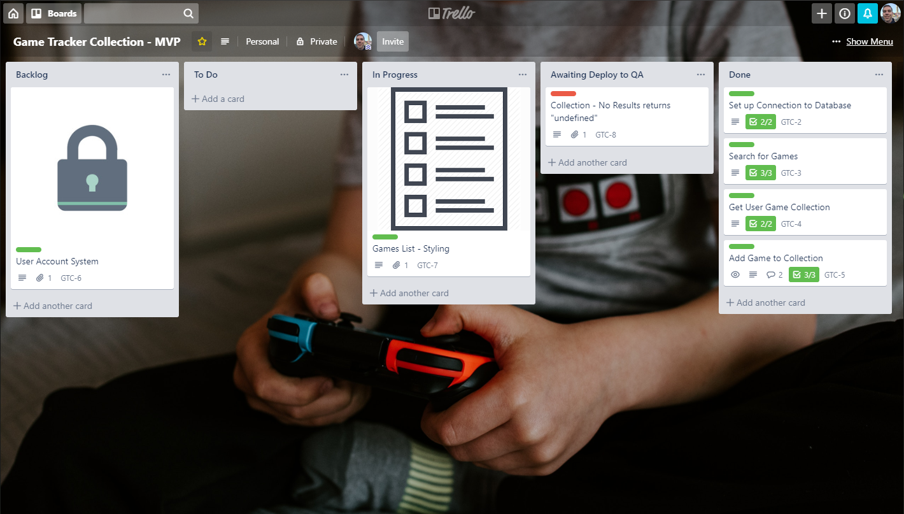

# Day 93: July 14, 2019

**Today's Progress:** Moved to Trello for Project Management and Issue Tracking. Decided to start styling site.

**Thoughts:** Tonight has been primarily organizational-based with some minor refactoring to the code (hence why I'm writing up an update). Thought about trying out adding a user log in system, but decided to spend more time on that for v1.0 and focus on getting the user feel right for the MVP.

Will continue to use our single database user until that's done.

