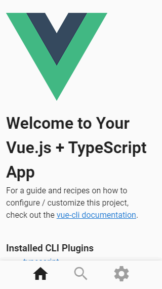

# Day 96: August 11, 2019

**Today's Progress:** Created new app with Vue CLI and started re-writing code into this app. Got build setup using Netlify.

**Thoughts:** Challenges thus far have been deciding how to configure project for what tools I wish to use, learning curve of Vuetify (lots of referencing the docs) and picking back up on Vue.js after not using it for a while.

**Resources**
* [Netlify](https://app.netlify.com/)
* [Vue.js](https://vuejs.org/)
* [Vuetify](https://vuetifyjs.com/en/components/api-explorer)
