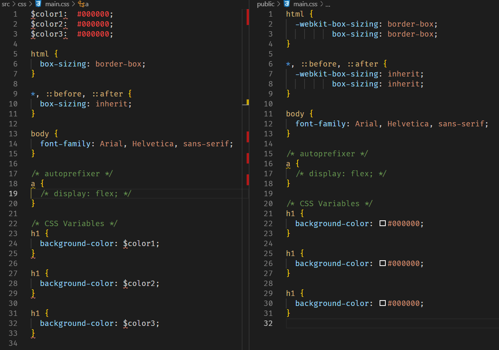

# Day 97: August 13, 2019

**Today's Progress:** Experimented with PostCSS CLI. Got it working with `autoprefixer` and `postcss-simple-vars` plugins.

**Thoughts:** Good first impressions with PostCSS (even after a couple hours of trial and error getting the CLI to work). I remember learning SASS and thinking it had a bunch of cool features, but I wouldn't be using all of them. PostCSS allows for only what you want which gives it a clearner feel. Once I get a better understanding of build processes and bundlers, I'll have to integrate that into future projects.

**Resources**
* [PostCSS CLI](https://github.com/postcss/postcss-cli)
* [Getting started with PostCSS in 2019](https://blog.logrocket.com/getting-started-with-postcss-in-2019-484262a4d725/)
* postcss autoprefixer not working - [Github Issue #140](https://github.com/zeit/next-plugins/issues/140)
